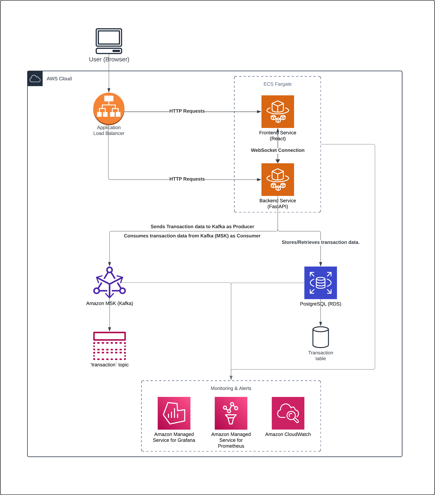

# Real-Time Fraud Detection System

## Project Overview

### Description
The Real-Time Fraud Detection System is designed to detect fraudulent transactions in real-time. Built using a microservice architecture and deployed on AWS, it efficiently handles transaction processing with Kafka, provides real-time notifications with WebSockets, and persists transaction data with PostgreSQL.

**[Live Demo](http://fraud-detection-alb-467209949.eu-west-2.elb.amazonaws.com/)**

### Tech Stack
- **Frontend:** React (JavaScript)
- **Backend:** FastAPI (Python)
- **Database:** PostgreSQL (AWS RDS)
- **Message Broker:** Kafka (AWS MSK)
- **Containerization:** Docker (AWS ECS Fargate)
- **Monitoring:** Prometheus, Grafana
- **Cloud Provider:** AWS (ECS, RDS, MSK, ALB)

### Features
- **Real-time transaction updates:** Using WebSockets to push notifications about processed transactions.
- **Asynchronous transaction processing:** Kafka ensures smooth handling of transactions by decoupling the producer and consumer processes.
- **Backend API:** FastAPI handles the business logic for processing transactions and interacting with Kafka and PostgreSQL.
-  **Fraud Detection Model:** A machine learning model is integrated into the backend to classify transactions as either fraudulent or legitimate in real-time.

- **Scalable architecture:** AWS services like ECS and MSK ensure the application can handle increasing traffic.

### Goals of the Project
- **Fraud Detection:** The system processes transactions and identifies potential fraud in real-time.
- **High Scalability:** The microservice architecture and AWS services ensure scalability to handle heavy traffic.
- **Real-Time Communication:** The WebSocket connection pushes transaction updates to clients instantly.

## Architecture Diagram


## Architecture Overview

The Real-Time Fraud Detection System follows a microservice architecture and leverages various AWS services to handle transaction processing, fraud detection, and real-time updates.

### 1. Application Load Balancer (ALB)
- ALB is responsible for routing both HTTP and WebSocket traffic to the ECS services (Frontend and Backend).
- It ensures load balancing and scalability for incoming client requests.

### 2. Frontend Service (React)
- The React frontend communicates with the backend through HTTP requests and WebSockets.
- HTTP is used for adding new transactions, and WebSockets for receiving real-time updates about the status of those transactions.

### 3. Backend Service (FastAPI)
- FastAPI handles all the business logic, processes incoming transactions, and communicates with Kafka and PostgreSQL.
- It pushes real-time updates to the frontend using WebSockets.
- The backend acts as both a Kafka producer (sending transactions to Kafka) and a Kafka consumer (processing transactions).

### 4. Kafka (MSK)
- Kafka (MSK) is used for asynchronous transaction processing.
- Transactions are sent from the backend to a Kafka topic (`transactions`).
- Kafka ensures that transaction data is processed independently of user requests.

### 5. PostgreSQL (RDS)
- The PostgreSQL database stores all transaction data.
- The backend service reads and writes transaction data from/to this database, using it for transaction validation and storage.

### 6. Monitoring and Alerting
- **Prometheus:** Collects metrics from the backend and other services.
- **Grafana:** Displays real-time monitoring data on a dashboard and can send alerts if something goes wrong.
- **CloudWatch:** Monitors the AWS infrastructure and sends alerts if there are any system issues (e.g., ECS container failure).

### 7. Machine Learning Model for Fraud Detection
- #### Overview
    The fraud detection system integrates a machine learning model that processes transactions in real-time. The model is designed to predict whether a transaction is fraudulent based on historical transaction data, which includes both legitimate and fraudulent transactions.
    
    #### Model Architecture
    - **Model Type:** Random Forest
    - **Features Used:** The model uses various features from the transaction data for fraud detection:
      - Transaction amount
      - User location
      - Time of the transaction
      - Frequency of past transactions

    #### Model Integration
    - **Model Deployment:** The machine learning model is deployed within the FastAPI backend service.
    - **Inference Process:** When a new transaction is received via the `/api/transaction` endpoint, the backend passes the transaction details to the model, which returns a fraud probability score.
    - **Fraud Prediction Flow:**
      1. **Transaction Submission:** A transaction is submitted via the frontend.
      2. **Model Invocation:** The backend sends the transaction data to the machine learning model for fraud detection.
      3. **Fraud Labeling:** The model predicts whether the transaction is fraudulent based on the features extracted.
      4. **Result Processing:** If the transaction is predicted to be fraudulent, the system flags it and can notify administrators or the user in real-time.
      5. **Database Update:** The result is stored in PostgreSQL along with the transaction details.
    
    #### Model Training and Data
    - **Dataset:** The model was trained on historical transaction data containing both fraudulent and non-fraudulent transactions.
    - **Training Process:** The data was pre-processed, cleaned, and fed into the machine learning algorithm, which was then trained to classify transactions.
    - **Performance Metrics:**
      - **Accuracy:** 87.50%
   
    #### Integration in the Backend
    The following is an overview of how the machine learning model is integrated into the backend:
    
    - **Transaction API Workflow:**
        1. **API Request:** When a transaction is submitted via the `/api/transaction` endpoint, the backend first validates the transaction details.
        2. **Model Call:** The backend calls the machine learning model to classify the transaction as either "fraudulent" or "legitimate."
        3. **Result Processing:** Based on the model's prediction, the transaction is marked as fraudulent or legitimate, and an appropriate response is sent back to the client.
        4. **Real-Time WebSocket Notification:** If the transaction is marked as fraudulent, a WebSocket event is triggered to notify the frontend in real-time.

## Infrastructure Setup

### 1. AWS ECS Fargate Setup (Frontend & Backend)
- Both the frontend and backend are deployed as Docker containers using AWS ECS Fargate, ensuring scalability and isolated resource allocation.

    #### Steps to Set Up:
    1. **ECS Cluster**: Create a cluster on ECS and choose Fargate as the compute option.
    2. **Task Definitions**: Create two task definitions, one for the backend and one for the frontend. Link each to its corresponding container image from Docker Hub or ECR.
    3. **Service Creation**: For each task definition, create a service that runs the containers. Enable auto-scaling if required.
    4. **Networking**: Set up the network to use the same VPC, and assign security groups to allow traffic between services.

### 2. AWS RDS (PostgreSQL) Setup
- AWS RDS provides a managed PostgreSQL instance, ensuring data durability and ease of management.

    #### Steps to Set Up:
    1. **Create a Database Instance**: Use the RDS console to create a PostgreSQL instance.
    2. **Security Groups**: Ensure that the backend service can access RDS by configuring the security groups to allow inbound traffic from ECS.
    3. **Parameter Settings**: Optimize RDS for performance by setting appropriate memory and connection limits.

### 3. Kafka (MSK) Setup
- AWS MSK is used to set up Kafka, ensuring that the application can handle real-time message streaming.

    #### Steps to Set Up:
    1. **Create MSK Cluster**: Use the AWS MSK service to create a Kafka cluster. Ensure that brokers are configured to scale based on traffic.
    2. **Security Setup**: Use IAM or plaintext authentication depending on your preference and secuirty needs. Configure security groups to ensure that only ECS services can access Kafka.
    3. **Create Kafka Topic**: Use the Kafka CLI to create the `transactions` topic:
        ```bash
        kafka-topics.sh --create --topic transactions --bootstrap-server <MSK-Bootstrap-Server>
        ```
### 4. Application Load Balancer Setup
- ALB routes traffic from clients to ECS services (backend and frontend).
    ### Steps to Set Up:
    1. **Create an ALB**: Use the EC2 console to create an ALB. Set it to handle both HTTP (for API requests) and WebSockets.
    2. **Configure Listeners**: Set up listeners for port 80 to route traffic to the appropriate target groups.
    3. **Target Groups**: Create target groups for the frontend and backend, ensuring each service is linked to its corresponding target.
    
    
## API Documentation

The FastAPI backend provides a comprehensive API for interacting with transactions and WebSockets. The auto-generated Swagger UI can be accessed at:

- **Swagger URL:** `http://http:/fraud-detection-alb-467209949.eu-west-2.elb.amazonaws.com/docs`

### Key Endpoints

1. **POST /api/transaction**
   - Adds a new transaction.
   - **Request Body:**
     - `user_id` (string): ID of the user.
     - `amount` (float): Transaction amount.
     - `location` (string): Location of the transaction.
   - **Response:**
     - `201 Created`: Transaction successfully added.

2. **WebSocket /api/ws**
   - Establishes a WebSocket connection.
   - **Description:** Listens for transaction updates in real-time.
   - **Example message:**
     ```json
     {
       "id": "string",
       "amount": "float",
       "location": "string",
        "user_id": "string",
       "is_fraud": "boolean"
     }
     ```

3. **GET /api/health**
   - A simple health check endpoint to ensure the backend is running.
   - **Response:** `200 OK` if the service is running.
   
   
## How to Run Locally

### Prerequisites
- Docker and Docker Compose installed.

### Steps to Run the Project

1. **Clone the Repository**
   ```bash
   git clone https://github.com/your-repo/realtime-fraud-detection.git
   cd realtime-fraud-detection
    ```
2. **Setup Environment Variables**
Ensure the ***.env*** files are properly configured for both backend and frontend services:
    ```
    #Realtime-Fraud-Detection (.env):
    POSTGRES_USER=fraud_app
    POSTGRES_HOST=postgres
    POSTGRES_PASSWORD=<password>
    POSTGRES_DB=transactions_db
    KAFKA_BROKER=kafka:9092
    KAFKA_TOPIC=transactions
    NEXT_PUBLIC_API_URL=http://localhost:8000/api
    NEXT_PUBLIC_CORS_ORIGIN=http://localhost:3001
    NEXT_PUBLIC_WS_URL=ws://localhost:8000
    ```
3. ***Start the Services with Docker Compose***
Run the following command to start both the backend and frontend services:
    ```
    docker-compose up
    ```
4. ***Accessing the Application***
    - Frontend: http://localhost:3001
    - Backend API (Swagger): http://localhost:8000/docs

## WebSocket Event Flows

### WebSocket Overview

The Real-Time Fraud Detection System uses WebSockets to provide real-time updates on transaction statuses. Once a client establishes a WebSocket connection with the backend, the server can push transaction data updates, including fraudulent transaction notifications, directly to the client without the need for polling.

### WebSocket URL

The WebSocket connection is established at the following endpoint:
- **WebSocket URL:** `wss://http://fraud-detection-alb-467209949.eu-west-2.elb.amazonaws.com//api/ws`

### WebSocket Flow

1. **Client Establishes Connection**
   - The frontend (React) creates a WebSocket connection to the backend using the following code:
       ```javascript
       const ws = new WebSocket(`${process.env.NEXT_PUBLIC_API_URL}/api/ws`);
        ```
2. **Backend Acknowledges Connection**
    - Upon connection, the FastAPI backend acknowledges the WebSocket connection and prepares to push real-time updates.
3. **Event Trigger (Transaction Processing)**
    - When a new transaction is processed, or its status changes (such as marking it as fraudulent), the backend pushes the update to all active WebSocket clients.
4. **Data Format**
    - The transaction data is sent in JSON format over the WebSocket. Here’s an example of the data that might be sent:
    ```json
    {
      "id": "transaction-12345",
      "user_id": "user-001",
      "amount": 250.00,
      "location": "New York",
      "time": "2024-09-28T10:34:15",
      "is_fraud": false
    }
    ```
4. **Client Receives and Renders Data**
    - The frontend listens for incoming messages and updates the UI to reflect the status of transactions in real-time:
        ```javascript
        ws.onmessage = (event) => {
          const transaction = JSON.parse(event.data);
          console.log('Transaction Update:', transaction);
          // Update the UI with the new transaction data
        };
         ```

### WebSocket Error Handling
In case of connection failures or errors, the frontend handles reconnections gracefully.

1. **Connection Closed**
    - If the connection to the WebSocket server is closed, the frontend attempts to reconnect after a specified delay.
        ```javascript
        ws.onclose = () => {
          console.log('WebSocket connection closed, attempting to reconnect...');
          setTimeout(() => {
            reconnectWebSocket();
          }, 5000);
        };
        ```
        
2. **Connection Errors**
    - Any errors that occur during the WebSocket connection are logged, and appropriate actions (e.g., reconnection) are triggered:
        ```javascript
        ws.onerror = (error) => {
          console.error('WebSocket error:', error);
        };
        ```
        
### WebSocket Use Cases in the Project
- Transaction Updates: After a user submits a transaction, the frontend receives real-time updates on whether the transaction has been processed, approved, or marked as fraudulent.
-  Fraud Alerts: If a transaction is flagged as fraudulent during processing, the system pushes an instant alert to the connected client(s) via WebSocket.


## Monitoring & Alerting

The Real-Time Fraud Detection System integrates monitoring and alerting using Prometheus, Grafana, and AWS CloudWatch to track system performance and detect any issues in real-time.

### 1. Prometheus

Prometheus is used to collect metrics from the various components in the architecture, including Kafka and PostgreSQL, providing visibility into system performance and health.

- **Integration with Kafka Exporter:**
  - Kafka Exporter exposes detailed metrics about Kafka, offering insights into consumer group lag, broker statuses, topic statistics, and partition data.
    - **Metrics Collected**:
        - Consumer group lag
        - Partition offsets
        - Broker availability
        - Topic replication

    - **Prometheus Configuration:**
      - Prometheus is configured to scrape metrics every 15 seconds.
      - Example configuration snippet:
          ```yaml
        scrape_configs:
          - job_name: 'kafka-exporter'
            static_configs:
              - targets: ['kafka-exporter:9308']
        ```
- **Integration with PostgreSQL Exporter:**
  - PostgreSQL Exporter collects metrics about the health and performance of the PostgreSQL database, such as connection counts, query performance, and cache hit ratios.
    - **Metrics Collected**:
        - Query execution times
        - Cache hit rates
        - Active connections
        - Query and table statistics

    - **Prometheus Configuration:**
      - Prometheus is configured to scrape metrics every 15 seconds.
      - Example configuration snippet:
          ```yaml
          - job_name: 'postgresql-exporter'
            static_configs:
              - targets: ['postgres-exporter:9187']
        ```
### 2. Grafana
Grafana is used to visualize the data collected by Prometheus, enabling real-time monitoring.

- Dashboards:
    - Grafana provides pre-built dashboards to visualize key metrics like CPU usage, memory consumption, request rates, and transaction processing times.
    - Alerts are configured in Grafana to notify administrators if certain thresholds are exceeded (e.g., high CPU usage or slow transaction processing times).
    
- Alerting Configuration:
    - Alerts are set to trigger if request processing time exceeds 500ms, and if the system detects an unusually high number of failed transactions.
    - Notifications are sent via email

### 3. AWS CloudWatch
AWS CloudWatch is responsible for monitoring AWS infrastructure resources, such as ECS tasks and RDS instances.
- CloudWatch Logs:
    - All ECS service logs (from the frontend and backend) are sent to CloudWatch for debugging and analysis.
    - CloudWatch also collects logs for Kafka (MSK) and PostgreSQL (RDS).

- CloudWatch Alarms:
    - Alarms are set up to notify administrators when certain thresholds are crossed, such as:
        - ECS service crashes or failures.
        - RDS instance CPU usage exceeding 80%.
        - Kafka broker failure.
### 4. Combining Monitoring Tools
Prometheus, Grafana, and CloudWatch work together to provide comprehensive monitoring:
- Prometheus tracks application-level metrics.
- Grafana visualizes these metrics and triggers alerts.
- CloudWatch monitors AWS infrastructure and system-level logs.# RealTime-Fraud-Detection
